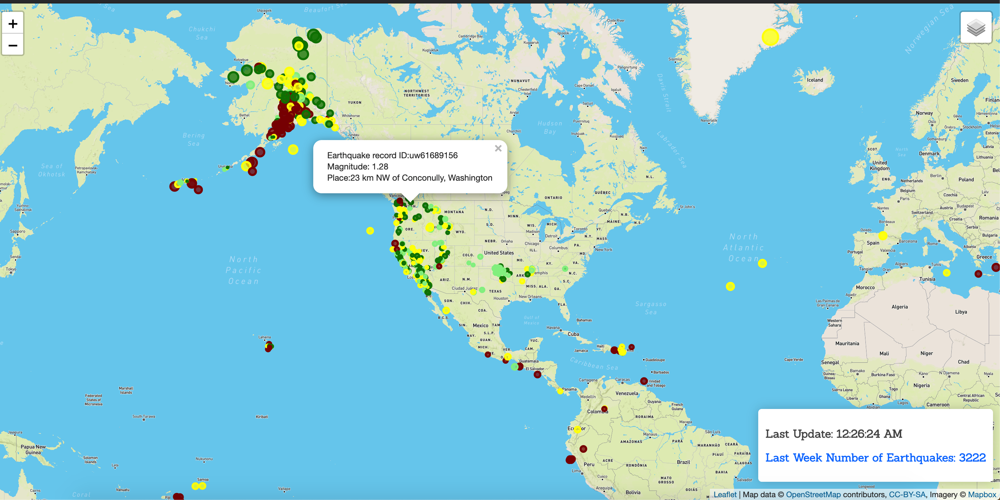
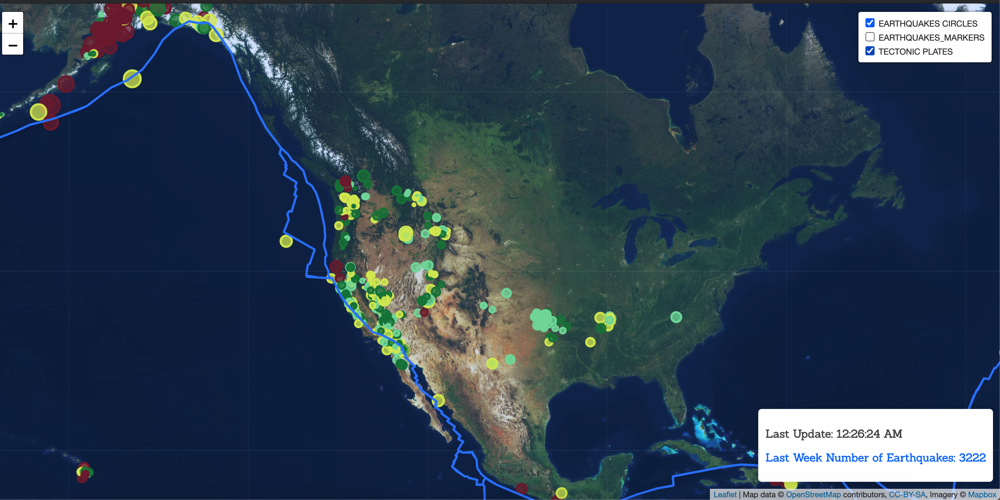

# Leaflet-challenge
* Build an interactive map to analyze Earthquake Data


[](http://commonmark.org)
[](http://hits.dwyl.com/OlegRyzhkov2020/d3-challenge)


The USGS provides earthquake data in a number of different formats, updated every 5 minutes. Visit the [USGS GeoJSON Feed](http://earthquake.usgs.gov/earthquakes/feed/v1.0/geojson.php) page and pick a data set to visualize. When you click on a data set, for example 'All Earthquakes from the Past 7 Days', you will be given a JSON representation of that data. You will be using the URL of this JSON to pull in the data for our visualization.

## Interactive Map Earthquakes Records



## Interactive Map with added layer: Tectonic plates



## Background Map, Leaflet Library

```JavaScript
// Create the tile layer that will be the background of our map
var streetmap = L.tileLayer("https://api.mapbox.com/styles/v1/mapbox/{id}/tiles/{z}/{x}/{y}?access_token={accessToken}", {
  attribution: "Map data &copy; <a href=\"https://www.openstreetmap.org/\">OpenStreetMap</a> contributors, <a href=\"https://creativecommons.org/licenses/by-sa/2.0/\">CC-BY-SA</a>, Imagery © <a href=\"https://www.mapbox.com/\">Mapbox</a>",
  maxZoom: 18,
  id: "streets-v11", //"light-v10",
  accessToken: API_KEY
});

```

## Exploring Data

```JavaScript
// Perform an API call to the Earthquakes Information endpoint
d3.json("https://earthquake.usgs.gov/earthquakes/feed/v1.0/summary/all_week.geojson", function(infoRes) {

  // Grabbing our GeoJSON data..
  d3.json(link, function(data) {
    // Creating a geoJSON layer with the retrieved data
    var tectPlates = L.geoJson(data, {}).addTo(layers["TECTONIC_PLATES"]);

    var data_features = infoRes.features;
    var lat, lon, location, depth, magnitude, updatedAt;
    var depth_array = [];
    console.log(data_features);
    console.log(data_features[0].properties);
    // Create an object to keep of the number of markers in each layer
    var quakesCount = {
      EARTHQUAKES_CIRCLE: 0,
      EARTHQUAKES_MARKERS: 0,
      TECTONIC_PLATES: 0
    };

    for (var i=0; i< data_features.length; i++) {
        // Update the station count
        quakesCount["EARTHQUAKES_CIRCLE"]++;

        updatedAt = data_features[i].properties.updated;
        lon = data_features[i].geometry.coordinates[0];
        lat = data_features[i].geometry.coordinates[1];
        depth = data_features[i].geometry.coordinates[2];
        magnitude = data_features[i].properties.mag;
        location = [lat,lon];
        depth_array[depth_array.length] = depth;
        //console.log(magnitude, depth, chooseColor(depth));

        var newCircle = L.circle(location, {
          fillOpacity: 0.75,
          color: chooseColor(depth),
          fillColor: chooseColor(depth),
          // Setting our circle's radius equal to the output of our markerSize function
          // This will make our marker's size proportionate to its population
          radius: markerSize(magnitude)
        });

        // Create a new marker with the appropriate icon and coordinates
        var newMarker = L.marker([lat, lon], {
          icon: icons["EARTHQUAKES_MARKERS"]
        });
        // Add the new marker to the appropriate layer
        newCircle.addTo(layers["EARTHQUAKES_CIRCLE"]);
        newMarker.addTo(layers["EARTHQUAKES_MARKERS"]);
        newCircle.addTo(layers["TECTONIC_PLATES"]);

        // Bind a popup to the marker that will  display on click. This will be rendered as HTML
        newMarker.bindPopup("Earthquake record ID:" + data_features[i].id + "<br> Magnitude: " + magnitude + "<br>" + "Place:" +data_features[i].properties.place);
        newCircle.bindPopup("Earthquake record ID:" + data_features[i].id + "<br> Magnitude: " + magnitude + "<br>" + "Place:" +data_features[i].properties.place);
        tectPlates.bindPopup("Earthquake record ID:" + data_features[i].id + "<br> Magnitude: " + magnitude + "<br>" + "Place:" +data_features[i].properties.place);
        // Call the updateLegend function, which will... update the legend!
        updateLegend(updatedAt, quakesCount);

      }
  })
});

```

## Contacts
[Find Me on
LinkedIn](https://www.linkedin.com/in/oleg-n-ryzhkov/)
